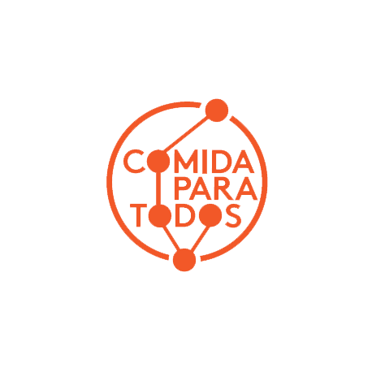
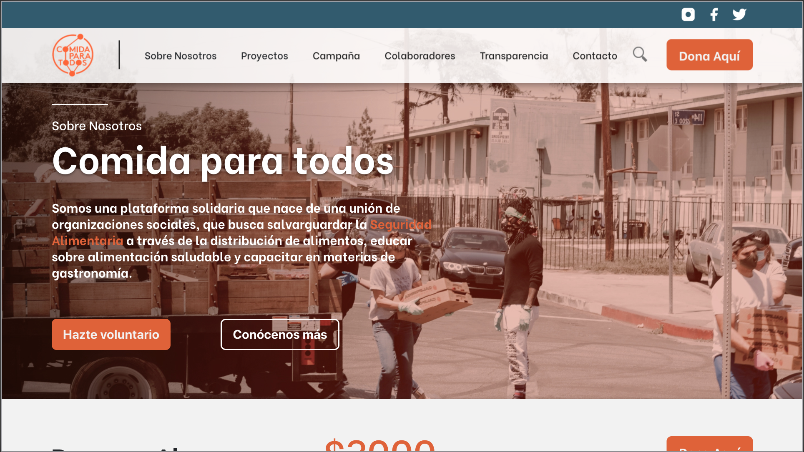
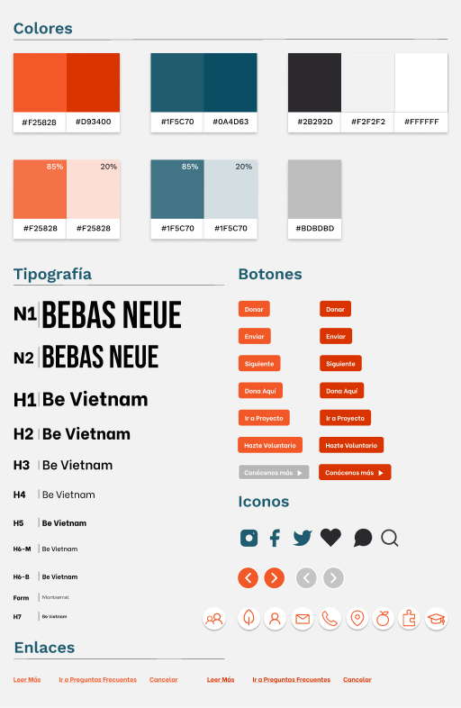

# Rediseño Comida Para Todos

## Índice:

* [1. Comida Para Todos.](#1-Comida-Para-Todos)
* [2. Comenzando a usarla.](#2-Comenzando-a-usarla)
* [3. Investigación.](#3-Investigación)
* [4. Proceso de prototipado y diseño.](#4-Proceso-de-Prototipado-y-diseño)
* [5. Aportes.](#5-Aportes)
* [6. Despliegue.](#10-Despliegue)
* [7. Herramientas.](#7-Herramientas)
* [8. Autoras.](#8-Autoras)

***

## 1. Comida Para Todos.

**¿Qué es Comida Para Todos?**

Comida para todos es una plataforma solidaria que nace de la unión de organizaciones sociales, que busca salvaguardar la Seguridad Alimentaria, a través de:

- Generar y distribuir alimentación.
- Educar en materias de alimentación saludable.
- Capacitar en materias de gastronomía.

**Rediseño Comida Para Todos**

Puedes conocerla y probarla [aquí](https://comida-paratodos.web.app/).

## 2. Comenzando a usarla 🚀

Este nuevo rediseño de ***Comida Para Todos*** esta implementado como un SPA(*Single Page Aplication*), desarrollada con **React** y desplegada en Hosting **Firebase** para su uso en Desktop a través de cualquier navegador web.

## 3. Investigación :busts_in_silhouette:

En esta etapa pudimos realizar una investigación para conocer más sobre ***Comida para Todos***, y poder visualizar lo que sería el punto de partida para poder comenzar a desarrollar el proyecto, cumpliendo los requerimientos del cliente y teniendo el propósito de alcanzar los objetivos para que la fundación pueda llegar a mayor cantidad de personas y con esto un sinfín de oportunidades para la comunidad.

En este proceso investigativo realizamos:

- Entrevista con Cliente (Conocer objetivos e ideales de ***Comida Para Todos***).
- Análisis Heurístico (Evalua la usabilidad del sitio actual).
- Benchmark (Estudio de mercado, directo e indirecto).
- Entrevista con Usuarios: (Conocer opiniones sobre el sitio actual y encontrar ideas para potenciarlo).
    - [Anne Carrere](https://drive.google.com/file/d/1PecRQcU9cwgfxkNmqEYRPWdkKLkxk8r5/view)
    - [Daniel Alfonzo](https://drive.google.com/file/d/1TSiZQgKV1YDS8qR3Uh9BWe2yYANnCpTw/view)
    - [Matias Carrasco](https://drive.google.com/file/d/1qgdxpoAPZppx7yUh1mZcpMoqlnWHeG0w/view)
    - [Yanira Flores](https://drive.google.com/file/d/1pYVRCxuhVBrEMKq-IAvme8p_XG9clCtZ/view)
- User Persona (Personaje ficticio que representa un usuario de la plataforma).
- Journey Map (Diagrama de interacción de usuarios con la plataforma).
- Affinity Map (Para categorizar, organizar la información recolectada)
- Insights (Descubrimientos).

## 4. Proceso de prototipado y diseño📋

#### Sketch:
Comenzamos construyendo diferentes Sketch.
Puedes revisarlo [aquí](https://www.figma.com/file/05HHF7BKZ4ydeePsR6vgSm/Comida-Para-Todos?node-id=1%3A2)

#### Prototipo de alta fidelidad:
El prototipo de alta fidelidad fue diseñado a través de la plataforma que ofrece Figma, dando énfasis en cómo luciría y el funcionamiento planeado.
Puedes revisarlo [aquí](https://www.figma.com/file/05HHF7BKZ4ydeePsR6vgSm/Comida-Para-Todos?node-id=1060%3A16).

#### Guia de Estilo

## 5. Aportes 🧡

Al involucrarnos con este proyecto nuestro objetivo principal siempre fue el de mejorar y optimizar ***Comida Para Todos***, para que sus objetivos pudieran no solo llegar a más personas, sino lograr que estas también se involucraran en el proceso.

Aqui una pequeña lista con los aportes ofrecidos a ***Comida Para Todos***:

- Posibilidad de no solo donar dinero.
- Plataforma de pago simple e incorporada en la misma plataforma.
- Acceso a todos los colaboradores en una presentación más agradable y accesible.
- Oportunidad de conocer y descubrir las diferentes maneras de *donar*.
- Información clara y transparente de los métodos de trabajo.
- Acceso visible a RRSS.
- Uso de material audiovisual que busca empatizar más con los usuarios.
- Permite visualizar el equipo que conforma comida para todos, otorgando confianza.
- Sección de contacto, para dudas o preguntas que quiza no hayan sido contempladas en la plataforma.

## 6. Despliegue 📦

Puedes acceder al deploy de nuestro proyecto [aquí](https://comida-paratodos.web.app/).

## 7. Herramientas 🛠️

En éste proyecto fueron utilizadas varias herramientas para llegar al resultado del producto entregado.
Las herramientas usadas fueron:

* [Figma.](https://www.figma.com/file/05HHF7BKZ4ydeePsR6vgSm/Comida-Para-Todos?node-id=1153%3A3130) – Para el prototipado de alta fidelidad.
* [Trello](https://trello.com/b/15mYPGhr/comida-para-todos) – Para la planificación.
* [Firebase](https://firebase.google.com) – Para el hosting.
* [Git y GitHub](https://github.com/xsamynox/comida-para-todos) – Para el trabajo colaborativo.
* [Boostrap](https://getbootstrap.com/) - Para caruseles y algunos elementos simples.

## 8. Autoras ✒️

Éste proyecto fue realizado en conjunto por alumnas de la generación 014 de Santiago, Chile de Laboratoria.

* **Iara Carrillo** 📝✨ - UX/UI Designer
* **Jeniffer Genoves** [GitHub](https://github.com/JenifferGenoves) :octocat: - Front-end Developer
* **Anelisse Acevedo** [GitHub](https://github.com/aneacevedo) :octocat: - Front-end Developer
* **Samantha Moreno** [GitHub](https://github.com/xsamynox) :octocat: - Front-end Developer
